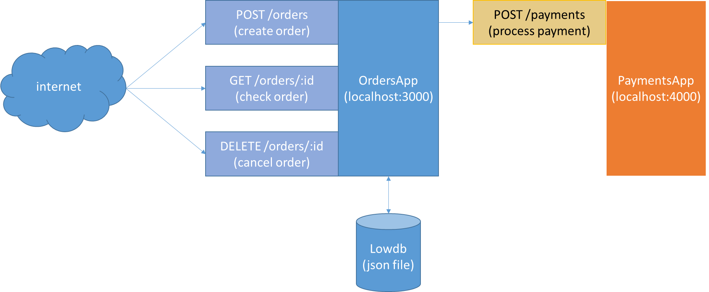

# Simple Order & Payment App
***

Simple OrdersApp that powered by ExpressJs to provide simple RESTful Order API with OAuth2 authentication.

It has connected to LowDB (JSON DB) for data persistent. Bunyan Logger also used to record activities in stream basis.

There are three kind of stubs data has been used in end-to-end use-case. I.e. books, customers, merchants.

PaymentsApp will return success status 70% of probability and fail 30% of probability. It is authenticated with Basic Strategy and some simple Express Validator.

Simple mocha test to assert API and LowDB is working well. Or can use POSTMAN app externally.

Install and Exec (Command)
1. npm install
2. npm start

Test (Command)
1. mocha

